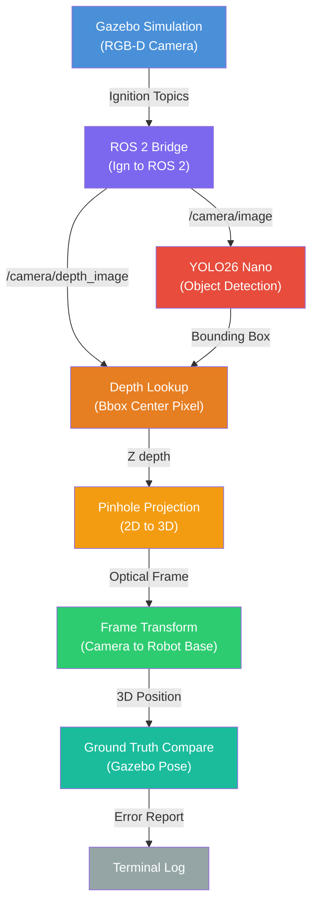

# Source Code Reference

This directory contains all Python source files and shell scripts for the LitterBot depth localization project.

---

## Detection Pipeline



---

## Python Scripts

| Script                          | Purpose                                                                            |
| ------------------------------- | ---------------------------------------------------------------------------------- |
| `depth_localizer.py`            | Main ROS 2 node — runs YOLO, reads depth, projects to 3D, compares to ground truth |
| `capture_camera_calibration.py` | Grabs camera intrinsics from ROS and saves to JSON                                 |
| `yolo_live_viewer.py`           | Real-time YOLO detection viewer with OpenCV GUI                                    |

---

### `depth_localizer.py` — Main Localization Node

The primary ROS 2 node. Subscribes to RGB, depth, camera info, and Gazebo pose topics. Runs YOLO26 Nano inference at 1 Hz, reads depth at the detected bounding box center, and back-projects to 3D using pinhole geometry with lens distortion correction. Accounts for camera pitch (20.34°) and height (0.65 m) when transforming from optical frame to robot base frame. Logs estimated vs ground-truth distance to `/tmp/litterbot_localizer.log`.

**Key parameters:** `YOLO_MODEL`, `YOLO_TARGET`, `YOLO_CONF`, `YOLO_SELECTION`, `ENABLE_ERROR_CORRECTION`

---

### `capture_camera_calibration.py` — Camera Calibration

Creates a temporary ROS 2 node, grabs one CameraInfo message, extracts intrinsics (fx, fy, cx, cy) and distortion coefficients, scales them if the image resolution differs from CameraInfo resolution, and writes to `results/camera_calibration.json`.

---

### `yolo_live_viewer.py` — Live YOLO Viewer

Subscribes to `/camera/image`, runs YOLO at up to 5 Hz, draws bounding boxes, and displays in an OpenCV window. Publishes annotated frames to `/yolo/image`. Set `YOLO_SHOW=0` for headless operation.

---

## Shell Scripts

Bringing up the full simulation stack requires launching multiple processes in the correct order: Gazebo must finish loading the world before the robot can be spawned, the ROS bridge needs a running simulation to connect to, and the localizer depends on active camera topics. Doing this manually in separate terminals is error-prone and slow, especially when tests require tearing down and restarting the stack with different configurations (e.g., dimmed lighting levels or a cluttered world file). We used Claude Code alongside OpenAI's Codex to develop a set of shell scripts that automate this entire workflow, from stack bring up and teardown, to scripted test sweeps that move the target object through dozens of positions and record results to CSV automatically. This let us focus on analyzing results instead of wrestling with process management.

### Stack Management

| Script                      | Purpose                                                                     |
| --------------------------- | --------------------------------------------------------------------------- |
| `start_litterbot_stack.sh`  | Launches entire stack (Gazebo → robot → bridge → calibration → localizer).  |
| `stop_litterbot_stack.sh`   | Gracefully kills all stack processes.                                       |
| `status_litterbot_stack.sh` | Shows running processes, active Gazebo/ROS topics, and log file locations.  |

### Simulation

| Script | Purpose |
|--------|---------|
| `run_gazebo_gui.sh` | Starts Gazebo with the world file. Supports `LIGHT_SCALE` for dimming (lighting tests). Uses software rendering for WSL2. |
| `spawn_robot.sh` | Spawns the LitterBot URDF into the Gazebo world. |
| `bridge_gazebo_topics.sh` | Bridges Ignition topics (camera, depth, poses) to ROS 2 topics. |

### Pipeline

| Script | Purpose |
|--------|---------|
| `run_localizer.sh` | Checks Python deps, then runs `depth_localizer.py`. |
| `run_yolo_viewer.sh` | Launches the live YOLO detection viewer. |
| `run_capture_calibration.sh` | Captures camera intrinsics to JSON. |

### Object Control

| Script | Purpose |
|--------|---------|
| `move_can.sh` | Moves the target bottle to position (X, Y, Z, YAW) via Gazebo set_pose service. Also writes pose to `/tmp/litterbot_target_pose.txt` for instant ground-truth updates. |

**Usage:** `bash scripts/move_can.sh 2.5 0 0.19 0`

### Test Automation

| Script | Purpose |
|--------|---------|
| `run_localization_tests.sh` | Main test harness — sweeps the bottle through positions and logs results to CSV. See **Test Modes** below. |
| `run_lighting_sweep.sh` | Automates all 10 lighting levels (100%–10%), restarting the stack with dimmed worlds. |

#### Test Modes

The `run_localization_tests.sh` script supports several modes that control how many positions the bottle is swept through:

| Mode       | Longitudinal | Lateral | Total Trials | Use Case                                                                                                                                                         |
| ---------- | ------------ | ------- | ------------ | ---------------------------------------------------------------------------------------------------------------------------------------------------------------- |
| `baseline` | 8            | 5       | 13           | Quick sanity check                                                                                                                                               |
| `extremes` | 100          | 70      | 170          | Full baseline sweep — pushes to the edges of the camera's detection range in both distance and lateral offset                                                    |
| `light_20` | 20           | 20      | 40           | Used by the lighting sweep. Reduced from `extremes` because the lighting sweep runs 10 brightness levels, so 170 trials per level would mean 1,700 total trials. |

**Usage:**
```bash
bash scripts/run_localization_tests.sh extremes
bash scripts/run_localization_tests.sh light_20
```

---

## Setup

### Prerequisites
- Ubuntu 22.04 (WSL2 supported)
- ROS 2 Humble
- Gazebo Fortress (Ignition)
- Python 3.10+

### Install Dependencies
```bash
bash scripts/install_python_deps.sh
```
This installs `numpy`, `opencv-python`, `matplotlib`, and `ultralytics` .

### Launch the Stack
```bash
source /opt/ros/humble/setup.bash
export ROS_LOCALHOST_ONLY=1
bash scripts/start_litterbot_stack.sh
```
This starts Gazebo, spawns the robot, launches the ROS bridge, captures camera calibration, and starts the localizer. 

### Verify
```bash
bash scripts/status_litterbot_stack.sh
```
Confirms all processes are running and topics are active.

---

## Test Procedures

### Baseline Test
Measures localization accuracy under ideal conditions (clean world, full lighting).

```bash
# Terminal 1: Start clean stack
bash scripts/start_litterbot_stack.sh

# Terminal 2: Watch localizer output
tail -f /tmp/litterbot_localizer.log

# Terminal 3 (optional): Live YOLO view
YOLO_TARGET=bottle bash scripts/run_yolo_viewer.sh

# Terminal 4: Run automated baseline sweep
bash scripts/run_localization_tests.sh extremes
```

Results are written to `results/localization_trials.csv`.

### Lighting Sweep Test
Tests detection across 10 brightness levels (100% down to 10%).

```bash
OUT_DIR=results_lighting bash scripts/run_lighting_sweep.sh
```

Each level restarts the stack with a dimmed world file. Results merge into a single CSV.

### Clutter Test
Tests detection accuracy with visual clutter (boxes, barrels, foliage) in the scene. Unlike the baseline and lighting tests, clutter trials are run manually rather than with an automated sweep. The automated position sweeps place the bottle at many positions throughout the cluttered environment, but a large number of those positions result in the bottle being physically occluded behind obstacles, completely hidden from the camera's view. Since the goal is to measure how visual clutter degrades *detection and localization accuracy* (not to test whether the system can see through walls), we manually choose positions where the bottle is actually visible to the camera while still surrounded by clutter.

```bash
# Terminal 1: Start with cluttered world
WORLD_FILE=sim/litterbot_world_clutter.sdf bash scripts/start_litterbot_stack.sh

# Terminal 2: Watch localizer output
tail -f /tmp/litterbot_localizer.log

# Terminal 3: Live YOLO view (verify bottle is visible before recording)
YOLO_TARGET=bottle bash scripts/run_yolo_viewer.sh

# Terminal 4: Manually move bottle to visible positions
bash scripts/move_can.sh 2.0 0 0.19 0
bash scripts/move_can.sh 1.5 0.3 0.19 0
bash scripts/move_can.sh 3.0 -0.5 0.19 0
```

The YOLO viewer is used to confirm the bottle is visible and not occluded before each trial is recorded. Results are logged to `/tmp/litterbot_localizer.log` and manually compiled.

---

## Dependencies

| Package | Used by | Purpose |
|---------|---------|---------|
| `rclpy` | depth_localizer, capture_calibration, yolo_viewer | ROS 2 Python client |
| `sensor_msgs` | depth_localizer, capture_calibration | ROS 2 image/camera messages |
| `tf2_msgs` | depth_localizer | Gazebo pose transforms |
| `cv_bridge` | depth_localizer, yolo_viewer | ROS Image ↔ OpenCV conversion |
| `ultralytics` | depth_localizer, yolo_viewer | YOLO26 inference |
| `opencv-python` | depth_localizer, yolo_viewer | Image processing, undistortion |
| `numpy` | depth_localizer | Array math |

---

## AI Disclaimer

This project was developed with the assistance of Claude Code (Anthropic) and OpenAI Codex. These tools were used to help write and debug Python source code, develop shell scripts for stack automation and test orchestration. All AI-generated code was reviewed, tested, and validated by the project authors. The system design, experimental methodology, test execution, and analysis of results were performed by the authors.
